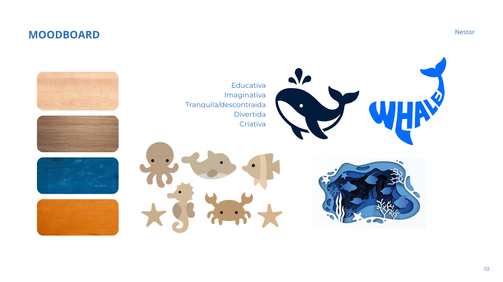

# Contexto de Design

## 1. Resumo / Abstract

### Resumo (PT)

O projeto Nestor consiste no desenvolvimento de uma coleção de brinquedos educativos em madeira inspirados no universo marinho e produzidos a partir do reaproveitamento de materiais da indústria do mobiliário. Desenvolvido pelo grupo BAM, o projeto procura promover a aprendizagem através do brincar, estimulando a criatividade, a imaginação e o desenvolvimento motor das crianças.

A coleção é composta pelos produtos Comboio do Mar, Balanceia e Baleia e Companhia, que exploram diferentes formas de interação através de sistemas de encaixe, equilíbrio e construção. Todos os objetos partilham uma linguagem visual comum baseada em formas arredondadas, elementos marinhos e princípios de sustentabilidade, refletindo os valores da marca Nestor: sabedoria, confiança, proteção e aprendizagem consciente.
### Abstract (EN)

Nestor is a collection of educational wooden toys inspired by the marine environment and produced using reclaimed materials from the furniture industry. Developed by the BAM group, the project aims to promote learning through play while encouraging creativity, imagination and children's motor development.

The collection includes the products Comboio do Mar, Balanceia and Baleia e Companhia, which explore different forms of interaction through construction, balancing and fitting systems. All products share a common visual language based on rounded shapes, marine elements and sustainability principles, reflecting the core values of the Nestor brand: wisdom, trust, protection and conscious learning.
## 2. Referências Coletivas

### 2.1. Recolha de Objetos a Redesenhar/Remisturar

Catálogo de objetos de partida que o grupo identificou para o redesenho. 

 - **Objeto 1- Jogo de equilíbrio em madeira — Playfinity** Referência utilizada para compreender a lógica de empilhar peças sobre uma base instável, explorando o peso, a posição e o equilíbrio.
- **Objeto 2- Animais marinhos em madeira — Aksiwoodtoys** Referência utilizada pela sua linguagem simples e pelas formas inspiradas no oceano, contribuindo para uma linguagem visual mais lúdica e adequada às crianças.

- **Objeto 3 - Carrinho Baleia Benê de Madeira (Pachu Design)** — Brinquedo infantil em madeira inspirado na forma de uma baleia, selecionado pela sua ligação ao universo marinho, pelas formas arredondadas e pela simplicidade da sua linguagem visual.

- **Objeto 4 - Quebra-cabeça de madeira Vaca Castanha (Ludimondo)**  O brinquedo é um quebra-cabeças de madeira inspirado nas pedagogias Montessori e Waldorf, composto por peças que se encaixam para formar um animal. Serviu como referência para o projeto por demonstrar como várias peças podem unir-se para criar uma figura completa, evidenciando as suas características principais.
### 2.2. Moodboard

Painel de referências visuais e conceptuais que orientam a estratégia do grupo.

## 3. Embalagem:

O desenvolvimento da embalagem da coleção Nestor, realizado coletivamente pelo grupo BAM, pode ser consultado em [Embalagem](embalagem/index.md)