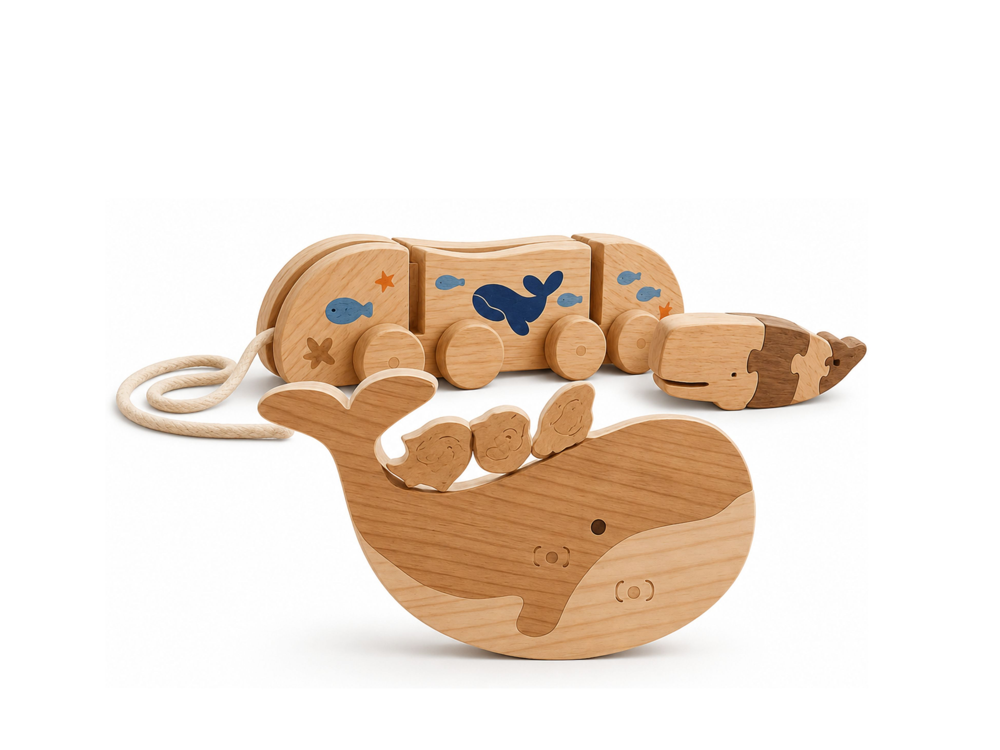
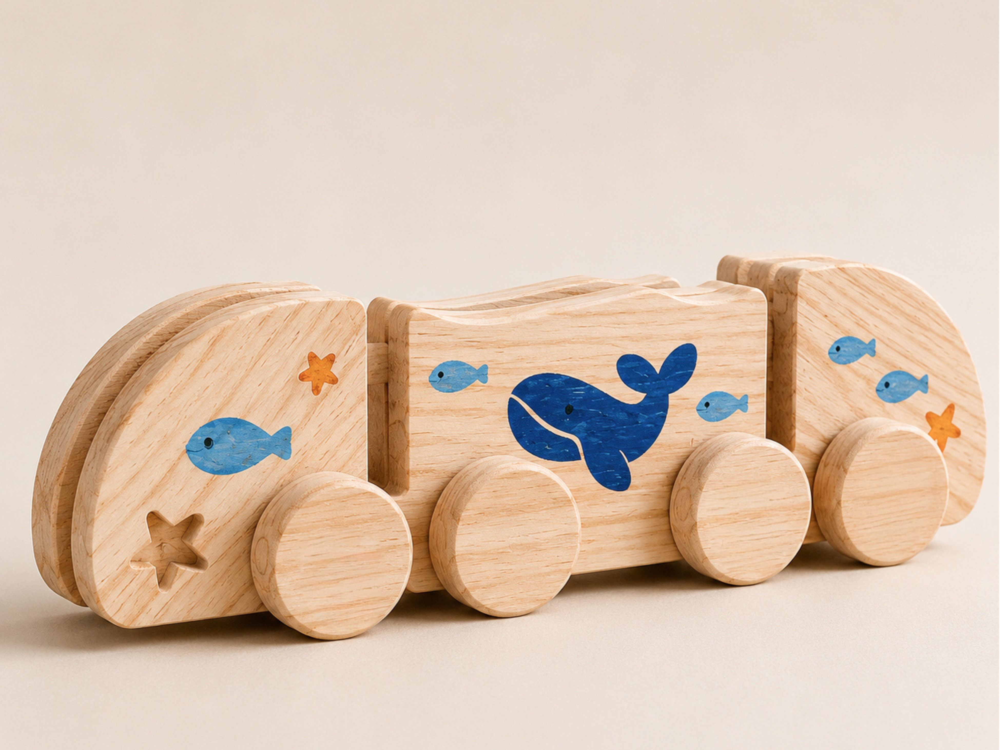
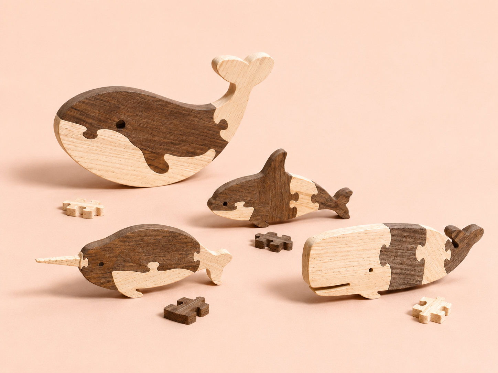

# BAM

> Três perspetivas criativas unidas na criação de brinquedos sustentáveis que promovem a aprendizagem através do brincar.

## Elementos do Grupo

| Número  | Nome             |
| ------- | ---------------- |
| 2024346 | Beatriz          |
| 2024280 | Mariana Ferretto |
| 2024565 | Assunção         |

---

## Contexto de Design

> O grupo BAM, constituído por Beatriz, Assunção e Mariana, desenvolveu uma coleção de brinquedos educativos em madeira inspirados no universo marinho.
> O projeto assenta em princípios de sustentabilidade, recorrendo ao reaproveitamento de materiais da indústria do mobiliário para criar objetos lúdicos e educativos. 
> Os produtos Comboio do Mar, Balanceia e Baleia e Companhia partilham uma linguagem visual comum caracterizada por formas arredondadas, elementos marinhos e uma estética simples e acolhedora. Em conjunto, promovem a criatividade, a coordenação motora, a imaginação e a aprendizagem através da exploração e da brincadeira livre. A coerência entre os projetos resulta da aplicação dos mesmos valores formais e conceptuais, refletindo a identidade da marca Nestor e a sua ligação ao universo infantil, ao oceano e à sustentabilidade.

Resumo, referências coletivas e moodboard do grupo encontram-se em [contexto.md](contexto.md).

[Ver contexto completo →](contexto.md)

---

## Galeria de Produtos

<!-- Cada thumbnail liga à página individual de cada produto.
     Cada produto vive em produtos/<numero>-<nome>/index.md
     e tem uma sub-página produtos/<numero>-<nome>/processo.md -->

<!-- markdownlint-disable MD033 -->

  <!-- duplicar o bloco abaixo para cada produto do grupo -->

  <a class="gallery-card" href="produtos/2024346-Beatriz/">
    
    <h3>Balanceia</h3>
    
Beatriz Cordeiro

  </a>
<a class="gallery-card" href="produtos/2024280-Mariana/">
    
    <h3>Comboio do Mar</h3>
    
Mariana Ferretto

  </a>
  <a class="gallery-card" href="produtos/2024565-Assunção/">
    
    <h3>Baleia e Companhia</h3>
    
Maria Assunção

  </a>
  <!-- duplicar o bloco acima para cada produto do grupo  e substituir _modelo em ambas por <numero>-<nome> -->

<!-- markdownlint-enable MD033 -->
