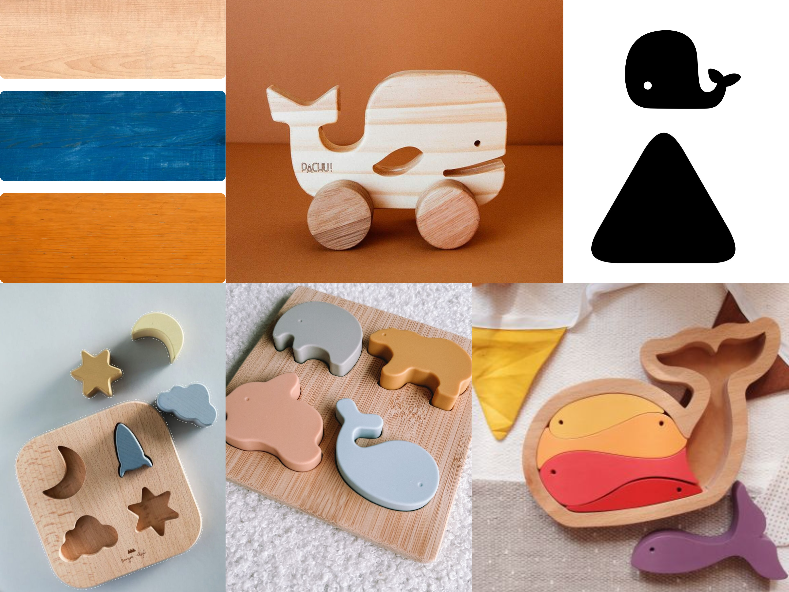
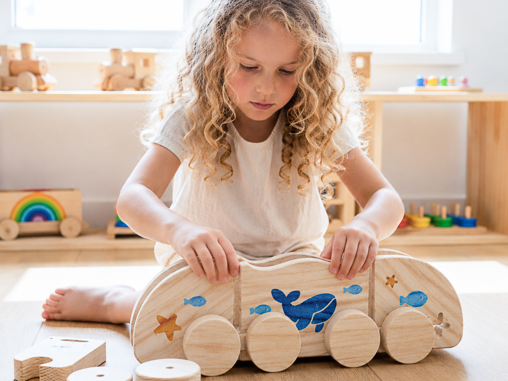
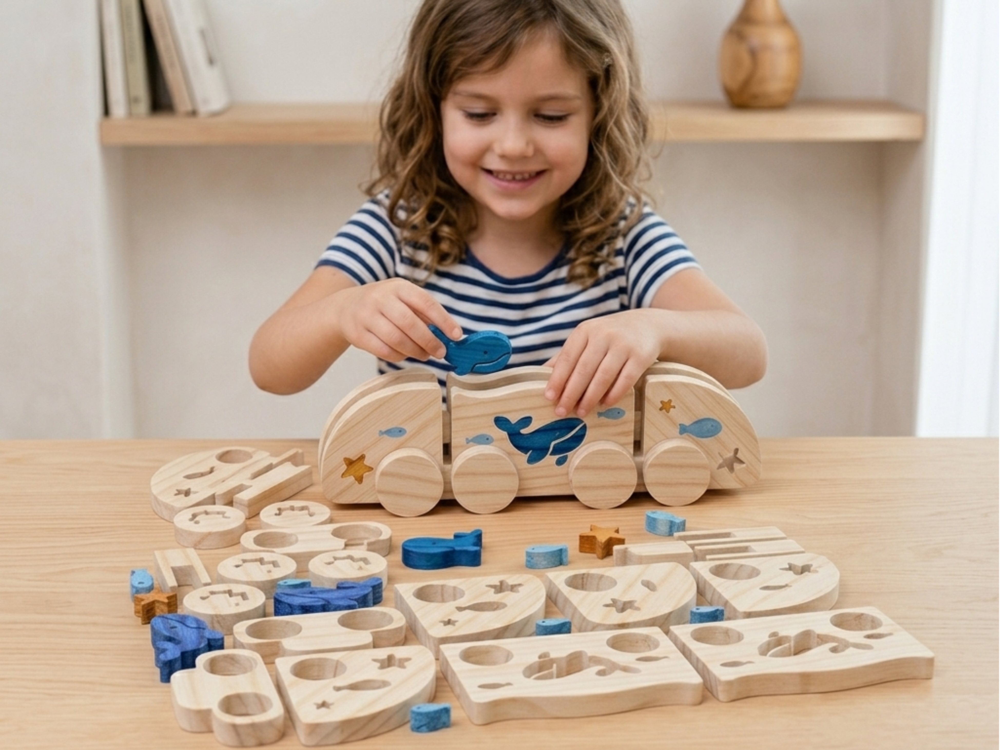

# Comboio do Mar

> Um puzzle de madeira inspirado no oceano que transforma a montagem numa experiência lúdica, educativa e criativa.

## Conceito

**O que é?**
Trata-se de um brinquedo em madeira inspirado no universo marinho, composto por um sistema de peças de encaixe que combina um puzzle tridimensional com a funcionalidade de um comboio. O conjunto integra elementos como uma baleia, peixes e estrelas-do-mar, permitindo a montagem e reorganização das diferentes peças.

**Para quem?**
Destina-se a crianças em idade pré-escolar e escolar, podendo ser utilizado em contextos educativos e recreativos. O brinquedo promove a exploração, a construção e a aprendizagem através da brincadeira.

**Porquê?**
O projeto incentiva o desenvolvimento da coordenação motora, da perceção espacial e da criatividade. Simultaneamente, valoriza a utilização da madeira como material sustentável, refletindo os princípios da marca Nestor de criar brinquedos educativos através de um design consciente e responsável.

## Enquadramento

O Comboio do Mar integra a coleção de brinquedos da marca Nestor, um projeto centrado na criação de brinquedos de madeira sustentáveis inspirados no universo marinho e produzidos a partir do reaproveitamento de materiais. Em conjunto com os projetos Balanceia e Baleia e Companhia, partilha os valores de criatividade, aprendizagem e desenvolvimento infantil através do brincar.

Dentro desta coleção, distingue-se por combinar um sistema de puzzle de encaixe com um comboio funcional, proporcionando simultaneamente uma experiência de construção e de brincadeira livre. A utilização de elementos marinhos, como a baleia, os peixes e as estrelas-do-mar, reforça a identidade visual da marca e a coerência entre os diferentes produtos da coleção.

## Tecnologia

O produto foi desenvolvido recorrendo ao software de modelação tridimensional **Autodesk Fusion 360**, utilizado para a criação do modelo digital e dos ficheiros técnicos necessários ao fabrico.

A produção das peças foi realizada através de tecnologia **CNC (Controlo Numérico Computorizado)**, utilizando **MDF com 15 mm de espessura**. Este processo permitiu obter cortes precisos, garantir a repetibilidade das peças e assegurar a qualidade dos encaixes necessários à montagem do brinquedo.

- Modelo 3D: 
[https://a360.co/4x4igfq](https://a360.co/4x4igfq)

## Função

O **Comboio do Mar** funciona simultaneamente como puzzle e brinquedo de transporte, a criança encaixa as diferentes peças e elementos decorativos para construir o comboio, podendo posteriormente utilizá-lo em brincadeiras livres graças às rodas funcionais.

O produto destina-se preferencialmente a crianças dos **3 aos 6 anos**, promovendo o desenvolvimento da coordenação motora fina, da perceção espacial, da capacidade de resolução de problemas e da criatividade.

A montagem é realizada através de encaixes simples entre as peças estruturais e as rodas, permitindo uma experiência intuitiva e adequada à faixa etária prevista.

O projeto foi desenvolvido considerando os princípios gerais de segurança estabelecidos pela **Diretiva 2009/48/CE relativa à segurança dos brinquedos**, nomeadamente a utilização de materiais adequados, a eliminação de arestas cortantes e a garantia de dimensões compatíveis com a utilização infantil.

## Apresentação

---

## Processo

O percurso completo de iterações, modelos e pesquisa está em [processo.md](processo.md), organizado do **mais recente** para o **mais antigo**.

[Ver processo completo →](processo.md)
