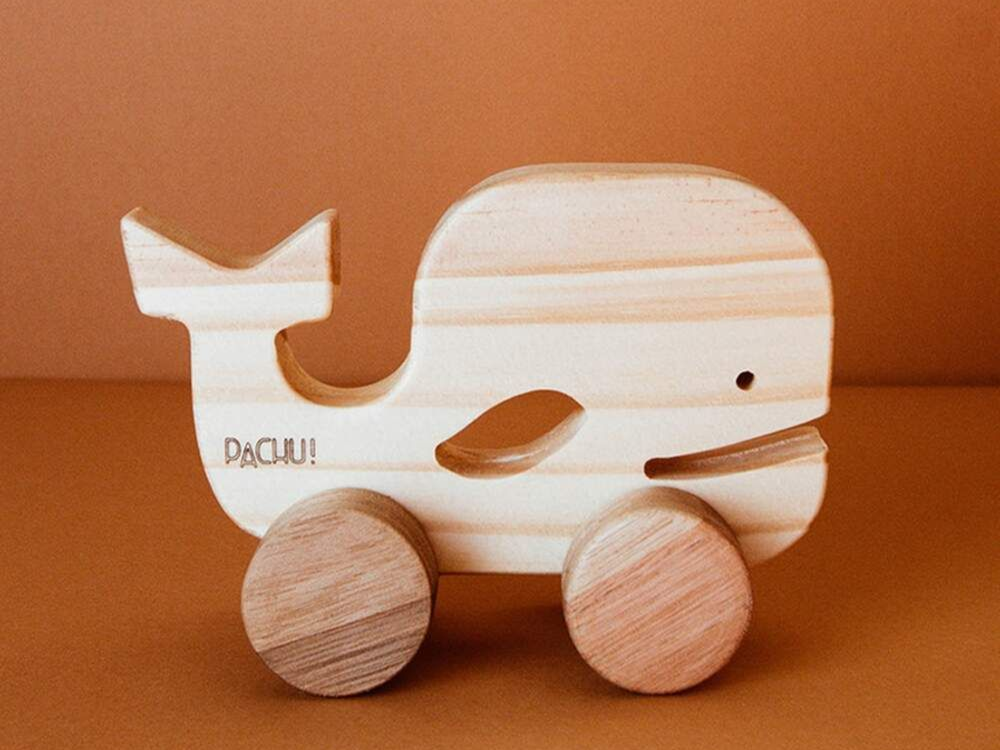

# Processo

> O desenvolvimento do Comboio do Mar envolveu pesquisa, experimentação formal, modelação digital e prototipagem física.

## 1. Protótipo(s)

Protótipo final produzido em MDF de 15 mm, representando a versão funcional do produto.

## 2. Processo de Prototipagem

O processo envolveu modelação no Fusion 360, preparação dos ficheiros, corte CNC, montagem e acabamentos finais.

Cortadora CNC - recurso Fablab Benfica
## 4. Modelos 3D

[https://a360.co/4x4igfq](https://a360.co/4x4igfq)

## 6. Esboços e Pranchas-Resumo

Exploração de formas, encaixes e organização dos elementos através de esboços e pranchas de síntese.

**prancha A3 de síntese.

**exploração de variantes.**

	O desenvolvimento do projeto começou com uma ideia bastante diferente da solução final: criar um puzzle que, depois de montado, pudesse permanecer exposto na vertical. Embora o conceito de um objeto construído através de peças de encaixe se tenha mantido ao longo do processo, a sua concretização foi evoluindo através da pesquisa e da exploração de referências. 
	Durante esta fase, foi identificado o Carrinho Baleia Benê, da Pachu Design, um objeto cuja linguagem formal e ligação ao universo marinho despertaram particular interesse. A partir dessa referência, surgiu a ideia de combinar o conceito inicial do puzzle com a funcionalidade de um brinquedo de movimento. Desta aproximação nasceu o Comboio do Mar, um brinquedo que integra um sistema de encaixes e espaços negativos, permitindo simultaneamente a construção, a exploração e a brincadeira livre.

**Primeira versão do Comboio do Mar**
[https://a360.co/43yxStX](https://a360.co/43yxStX)

Esta foi a primeira versão desenvolvida. A partir da análise do protótipo, foram identificadas oportunidades de melhoria relacionadas com a escala do objeto, a estabilidade da composição e o potencial de interação. Como resposta, o design foi reformulado, aumentando as dimensões gerais do brinquedo e introduzindo um maior número de peças de encaixe.
Estas alterações permitiram enriquecer a experiência de utilização, tornando o processo de montagem mais desafiante e estimulante para a criança. Paralelamente, a nova versão reforçou a presença dos elementos marinhos e melhorou a relação entre as diferentes peças, contribuindo para uma solução final mais coerente, funcional e visualmente equilibrada.
## 7. Pesquisa

### 7.1. Aspectos valorizados do moodboard, desconstrução da forma (o que distingue o programa formal)

Foram valorizadas as formas arredondadas presentes na identidade visual da marca Nestor, bem como a coerência estética entre os projetos coletivos do grupo. A linguagem visual associada ao oceano e às formas orgânicas influenciou diretamente o desenvolvimento formal do Comboio do Mar, garantindo uma ligação consistente entre o projeto individual e o universo visual da coleção.

### 7.2. Objeto de referencia

**Objeto 1 – Carrinho Baleia Benê de Madeira (Pachu Design)**  Brinquedo infantil em madeira inspirado na forma de uma baleia, selecionado pela sua ligação ao universo marinho, pelas formas arredondadas e pela simplicidade da sua linguagem visual. A análise deste objeto permitiu identificar uma experiência de utilização centrada principalmente no movimento do carrinho, com reduzidas possibilidades de construção e interação. A partir desta referência surgiu o desenvolvimento do **Comboio do Mar**, que procura expandir a experiência lúdica através da introdução de um sistema de peças de encaixe, promovendo a criatividade, a exploração espacial e a aprendizagem através da construção.

