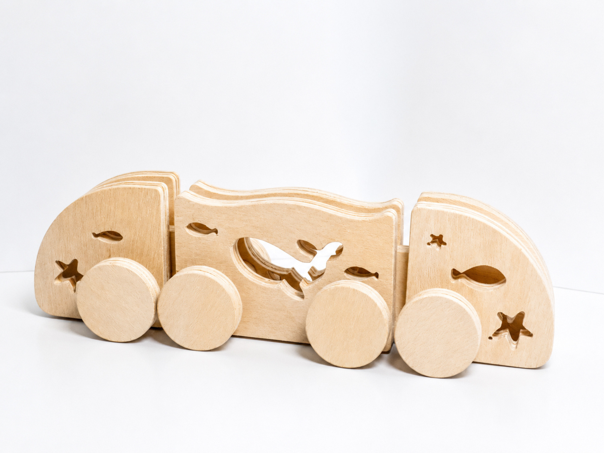
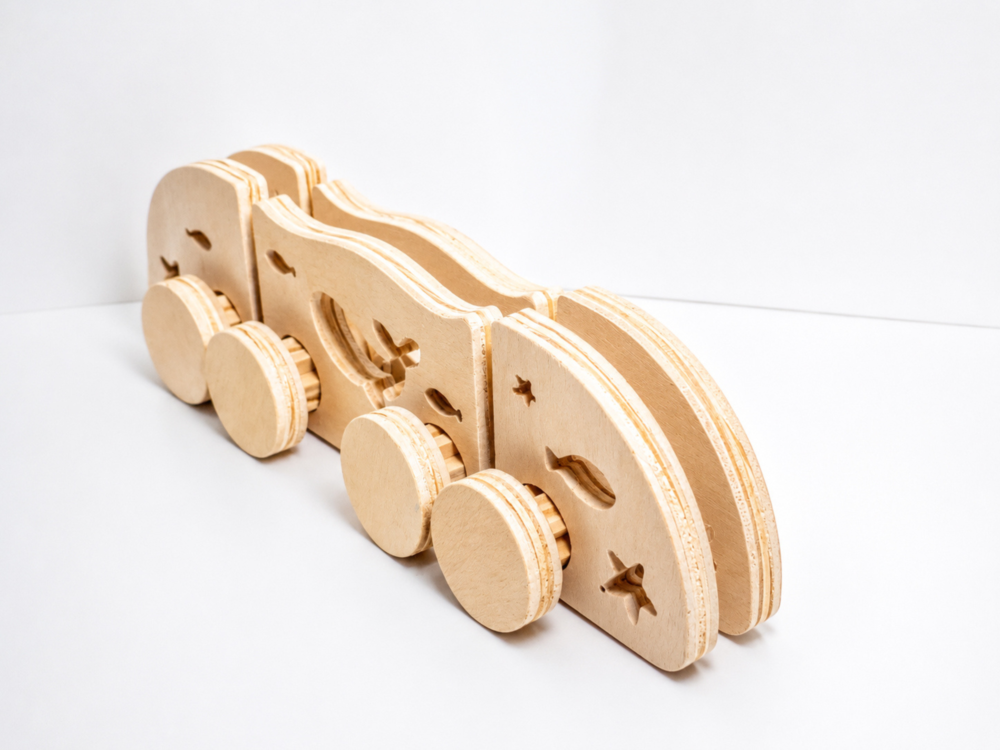
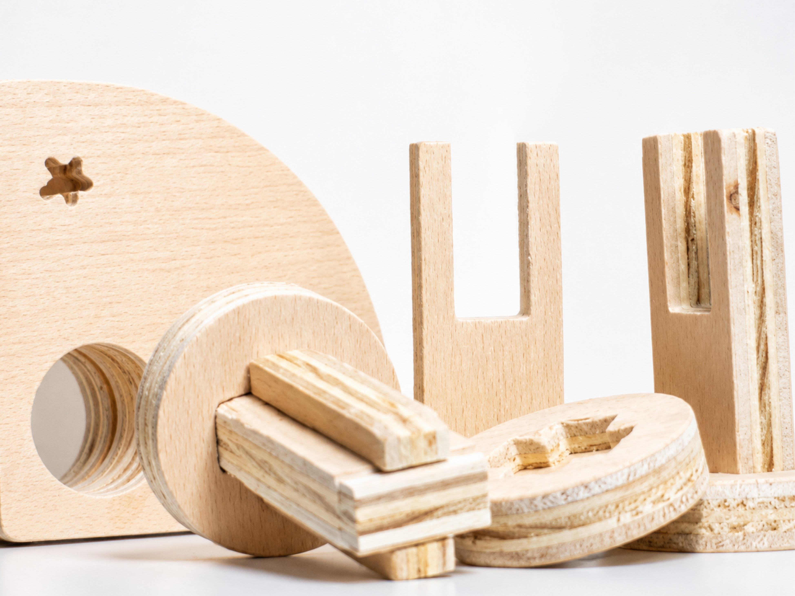
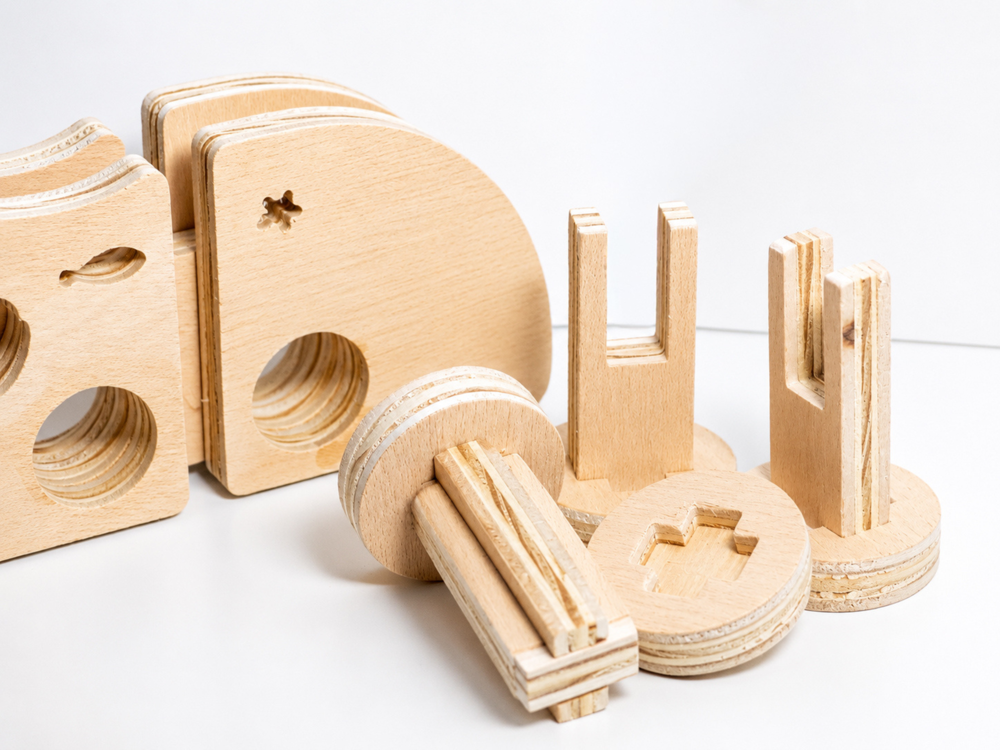
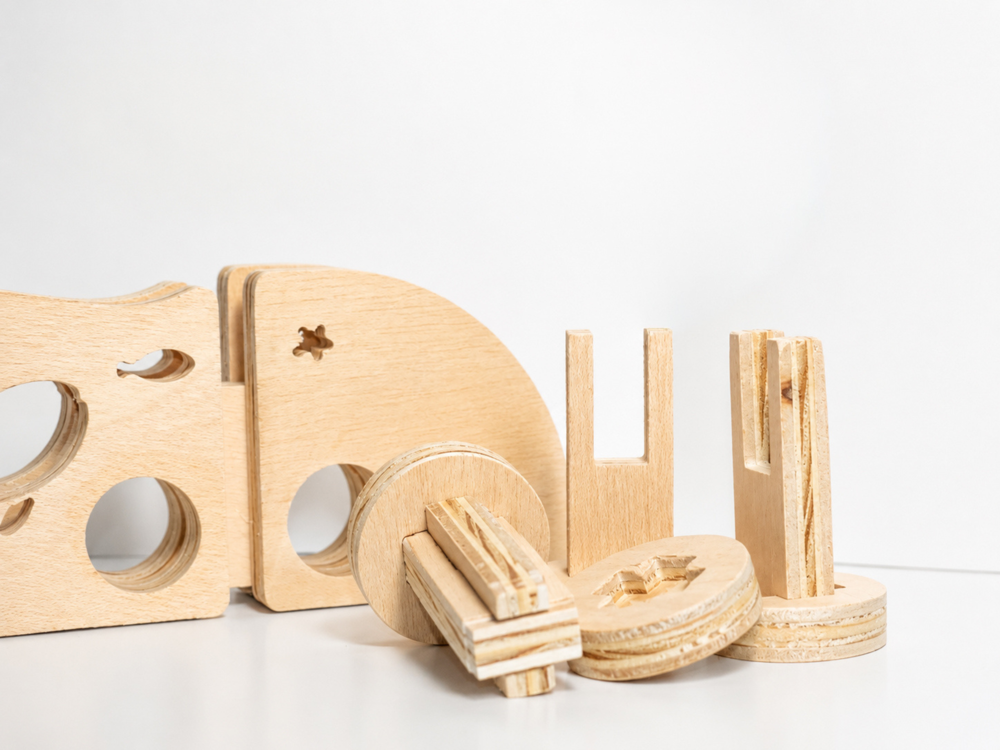
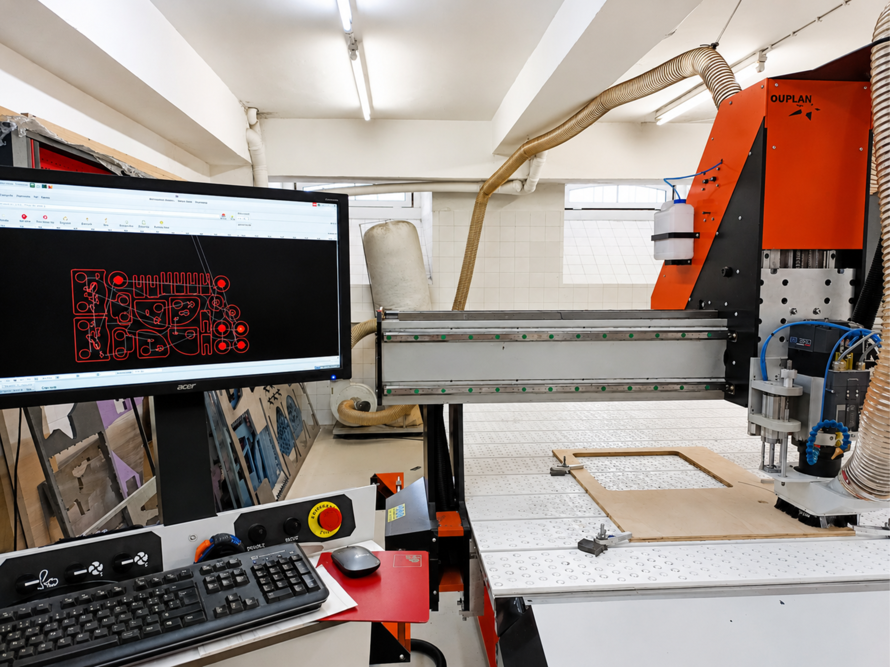
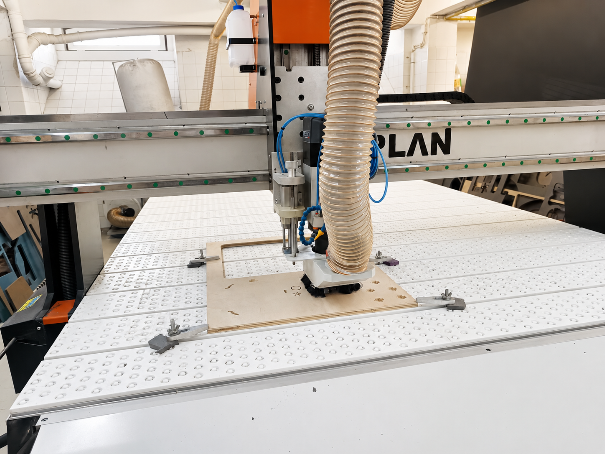
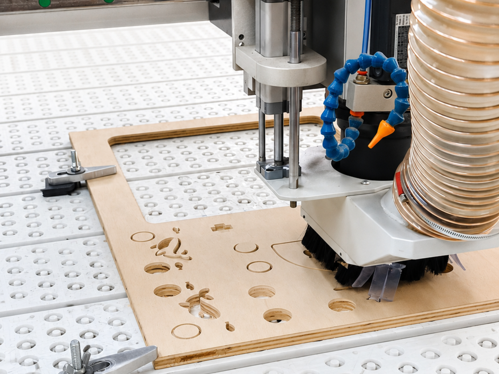

# Processo

> O desenvolvimento do Comboio do Mar envolveu pesquisa, experimentação formal, modelação digital e prototipagem física.

## 1. Protótipo(s)

Protótipo final produzido em MDF de 15 mm, representando a versão funcional do produto.

## 2. Processo de Prototipagem

O processo envolveu modelação no Fusion 360, preparação dos ficheiros, corte CNC, montagem e acabamentos finais.

## 4. Modelos 3D

[https://a360.co/4x4igfq](https://a360.co/4x4igfq)

## 6. Esboços e Pranchas-Resumo

Exploração de formas, encaixes e organização dos elementos através de esboços e pranchas de síntese.

Desenhos manuais, 
pranchas A3 de síntese, 
exploração de variantes.

## 7. Pesquisa

### 7.1. Aspectos valorizados do moodboard, desconstrução da forma (o que distingue o programa formal)

Foram valorizadas as formas arredondadas presentes na identidade visual da marca Nestor, bem como a coerência estética entre os projetos coletivos do grupo. A linguagem visual associada ao oceano e às formas orgânicas influenciou diretamente o desenvolvimento formal do Comboio do Mar, garantindo uma ligação consistente entre o projeto individual e o universo visual da coleção.

### 7.2. Objetos de referencia

