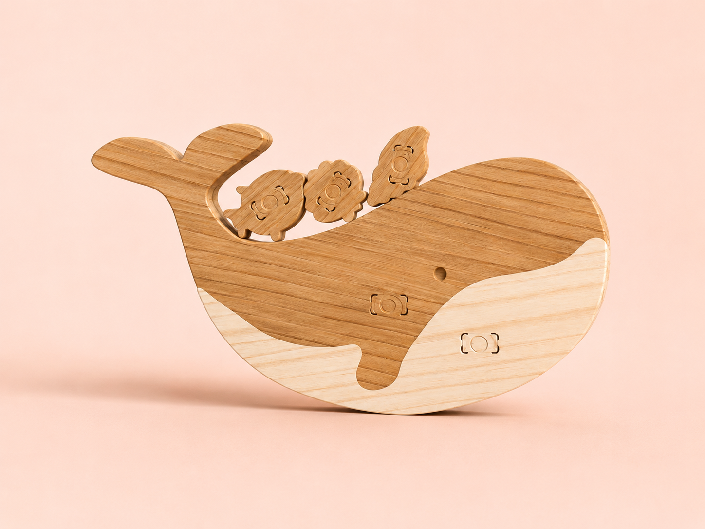
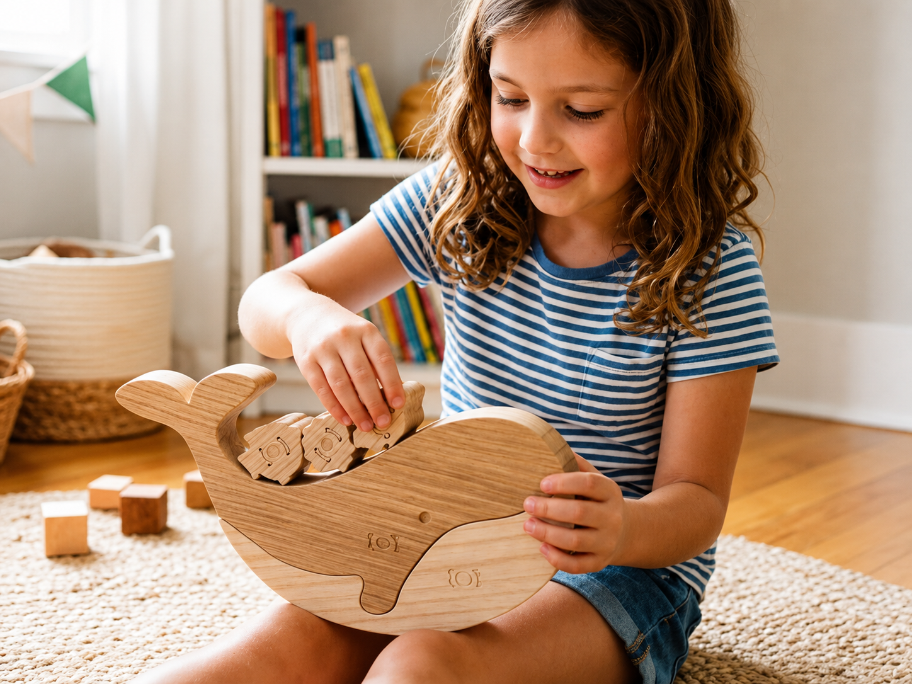

# Balanceia

>Um brinquedo de madeira em forma de baleia, pensado para desafiar a criança a equilibrar peças, explorar soluções e brincar de forma criativa.

## Conceito

##### O que é?

O Balanceia é um brinquedo em madeira em forma de baleia, desenvolvido como um jogo de equilíbrio. A peça principal funciona como base, onde a criança deve colocar pequenos elementos, como conchas e peças marinhas, tentando mantê-los equilibrados sem os deixar cair.

O brinquedo inclui uma base superior desmontável, que pode ser retirada e substituída por outras bases inspiradas em diferentes espécies de baleias. Estas variações alteram a dificuldade do jogo, tornando a experiência mais desafiante a cada utilização.

A proposta combina uma estrutura simples com uma dinâmica de tentativa e erro, permitindo que a criança explore o peso, o equilíbrio e a organização das peças de forma intuitiva. Assim, o Balanceia estimula a coordenação motora através de uma experiência lúdica e educativa.

##### Para quem?

O brinquedo destina-se ao público infantil, especialmente a crianças em idade pré-escolar e escolar. Foi pensado para ser utilizado em contexto de brincadeira livre, podendo também ser integrado em ambientes educativos, onde a criança aprende através da experimentação.

Pode ser utilizado individualmente ou por duas pessoas, permitindo tanto uma experiência de exploração autónoma como uma brincadeira partilhada. A sua utilização é adequada a crianças que estejam a desenvolver a coordenação motora e a perceção espacial.

##### Porquê?

O projeto surge da intenção de criar um brinquedo que transforme uma ação simples, como equilibrar peças, numa experiência de aprendizagem e descoberta. Ao colocar os elementos sobre a baleia, a criança experimenta diferentes soluções, observa o comportamento das peças e compreende, de forma intuitiva, como o peso e o equilíbrio influenciam a estabilidade do jogo.

Para além do lado educativo, o Balanceia valoriza uma linguagem visual simples, o contacto com materiais naturais e uma forma de brincar mais consciente. A utilização da madeira reforça a durabilidade do brinquedo e aproxima-o dos valores da marca Nestor, centrados na sustentabilidade, na qualidade e na criação de objetos pensados para acompanhar o desenvolvimento infantil.
X

## Enquadramento

O Balanceia integra a coleção de brinquedos da marca Nestor, um projeto centrado na criação de brinquedos de madeira sustentáveis, desenvolvidos a partir do reaproveitamento de materiais da indústria do mobiliário.

Dentro desta coleção, o brinquedo distingue-se por transformar a forma da baleia num jogo de equilíbrio. A presença de elementos marinhos, como conchas e pequenas peças associadas ao oceano, reforça a identidade visual da marca e cria uma ligação coerente com os restantes produtos.
## Tecnologia

O produto foi desenvolvido com recurso ao software Autodesk Fusion 360, utilizado para a modelação tridimensional do brinquedo e para a preparação dos ficheiros técnicos necessários à produção.

A produção das peças é realizada em MDF com 12 mm de grossura, através de tecnologia CNC (Controlo Numérico Computorizado). Este processo garante maior precisão nos encaixes, repetibilidade das formas e qualidade no acabamento, permitindo transformar o modelo digital num objeto físico funcional.

- Modelo 3D: (LINK FUSION)
## Função

O **Balanceia** funciona como um jogo de equilíbrio, no qual a criança coloca pequenos elementos sobre a estrutura da baleia, tentando mantê-los estáveis sem os deixar cair.

O produto destina-se preferencialmente a crianças dos **3 aos 6 anos**, promovendo o desenvolvimento da coordenação motora e da perceção espacial através da manipulação das peças.

A montagem inicial consiste na união de duas faces iguais de cada peça, criando a grossura necessária para dar resistência ao brinquedo. Depois, a base superior da baleia pode ser encaixada e desencaixada da base inferior, permitindo trocar entre diferentes formas inspiradas em espécies de baleias e variar o nível de dificuldade.

No desenvolvimento do projeto foram considerados os requisitos gerais de segurança presentes na **Diretiva 2009/48/CE relativa à segurança dos brinquedos**, com especial atenção à seleção de materiais apropriados, à remoção de arestas cortantes e à definição de dimensões adequadas ao manuseamento infantil.
## Apresentação

---

## Processo

O percurso completo de iterações, modelos e pesquisa está em [processo.md](processo.md), organizado do **mais recente** para o **mais antigo**.

[Ver processo completo →](processo.md)
