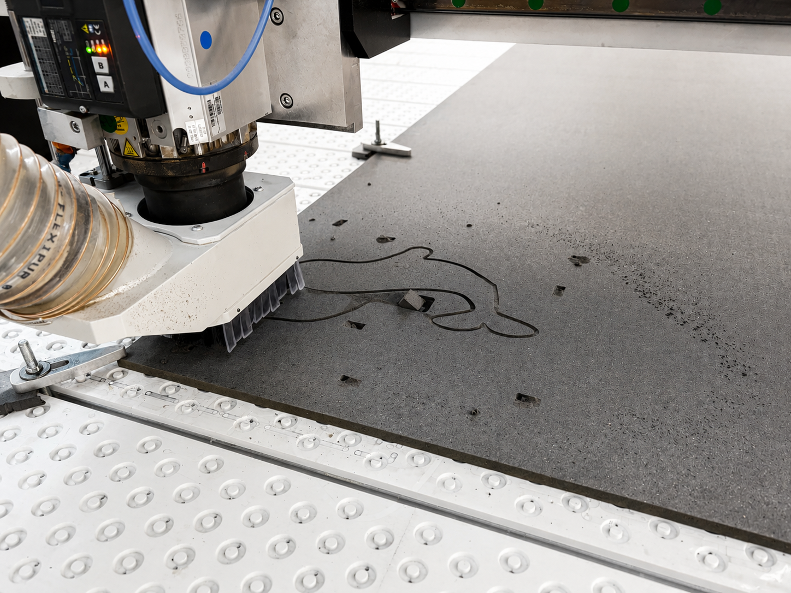
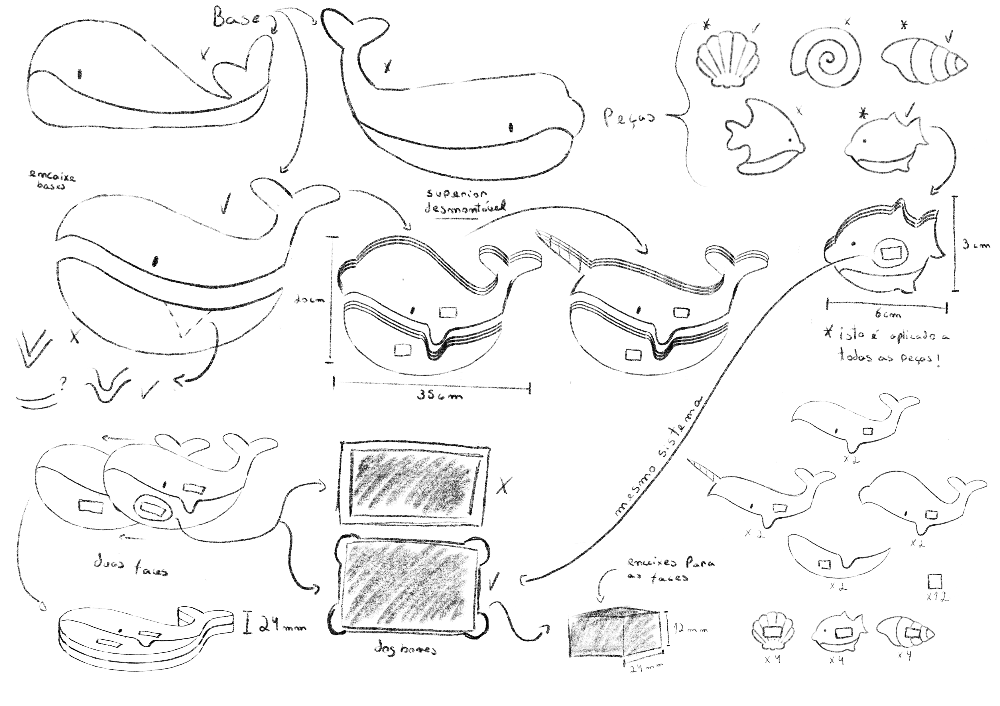
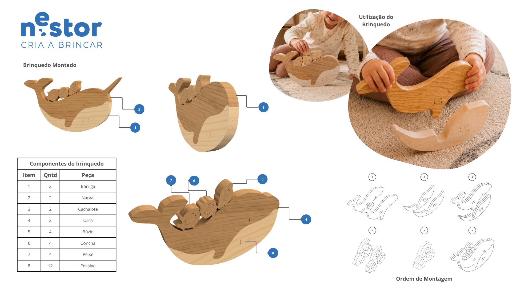

# Processo

> O desenvolvimento da Balanceia envolveu pesquisa, experimentação formal, modelação digital e prototipagem física.

## 1. Protótipo(s)

Protótipo final produzido em **Valchromat de 12 mm**, representando a versão funcional do produto.

## 2. Processo de Prototipagem

O processo passou pela modelação no Fusion 360, pela preparação dos ficheiros técnicos, pelo corte CNC, pela montagem das peças e pelos acabamentos finais.

## 3. Modelos 3D

[https://a360.co/4udgRkQ](https://a360.co/4udgRkQ)
ultima versão

[https://a360.co/4uF94eY](https://a360.co/4uF94eY)
Primeira versão

**Evolução Modelo 3D**
Durante o desenvolvimento da **Balanceia**, a modelação 3D no **Fusion 360** permitiu testar a forma, a montagem e o funcionamento do brinquedo. A primeira versão era mais simples, composta pela base superior e inferior da baleia, servindo para perceber a lógica dos encaixes e do equilíbrio.

Ao longo do processo, a forma da baleia foi ajustada, as peças ganharam maior definição e foram criadas diferentes bases superiores inspiradas em espécies de baleias, permitindo variar os níveis de dificuldade.

Foram também testados os encaixes, a espessura das peças e a estabilidade do conjunto. No último modelo 3D, foram adicionados **dogbones** nos encaixes, melhorando a produção em **CNC** e garantindo um encaixe mais preciso. A versão final tornou-se mais, funcional e adequada à utilização por crianças.
## 4. Esboços e Pranchas-Resumo

Os **esboços** foram uma fase de exploração visual da **Balanceia**, permitindo estudar a silhueta da baleia, a escala do brinquedo e a relação entre os elementos do jogo. Através destes desenhos, foi possível desenvolver ideias iniciais e procurar soluções mais claras para comunicar o seu funcionamento.

Nesta fase foram definidos elementos importantes, como a separação entre a base superior e inferior, as peças marinhas, o dado e a lógica de montagem.

A **prancha resumo** reúne estas decisões, apresentando o conceito, as medidas, os componentes, a utilização e a ordem de montagem, funcionando como uma síntese visual do projeto ligado à marca **Nestor.**

## 5. Pesquisa

### 5.1. Aspectos valorizados do moodboard, desconstrução da forma (o que distingue o programa formal)

A pesquisa visual partiu da observação de formas associadas ao oceano, à madeira e às diferentes espécies de baleias. Esta análise ajudou a definir a linguagem formal da **Balanceia**, com especial atenção às curvas, às silhuetas simples e à relação entre forma e função.

A base superior desmontável surgiu a partir desta exploração, permitindo criar variações inspiradas em diferentes baleias e alterar o nível de dificuldade do jogo. A presença de elementos marinhos e da madeira reforça a identidade do brinquedo, criando uma ligação coerente com a marca **Nestor** e com a experiência de brincadeira.
### 5.2. Objeto de referencia

**Objeto 1. Jogo de equilíbrio em madeira — Playfinity**
Referência utilizada para compreender a lógica de empilhar peças sobre uma base instável, explorando o peso, a posição e o equilíbrio.

**Objeto 2. Animais marinhos em madeira — Aksiwoodtoys**
Referência utilizada pela sua linguagem simples e pelas formas inspiradas no oceano, contribuindo para uma linguagem visual mais lúdica e adequada às crianças.

Em conjunto, estas referências ajudaram a desenvolver a **Balanceia** como um brinquedo que combina uma dinâmica de jogo desafiante com uma linguagem visual ligada ao oceano.

