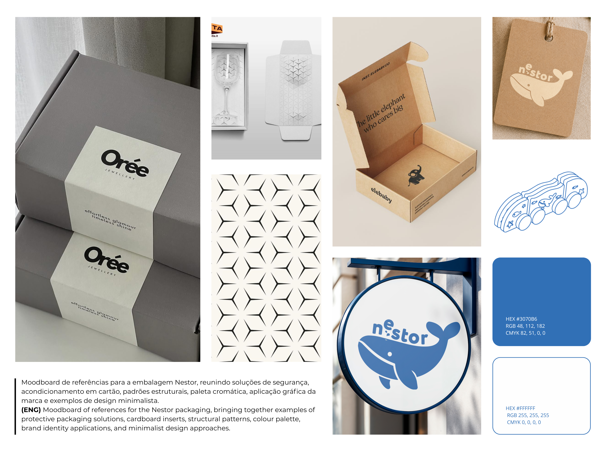
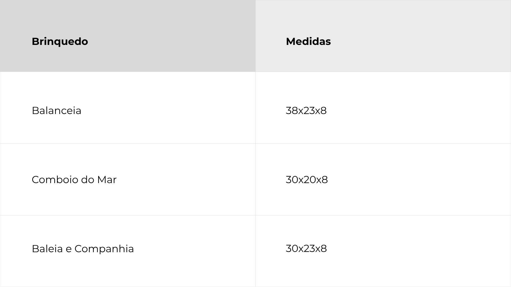
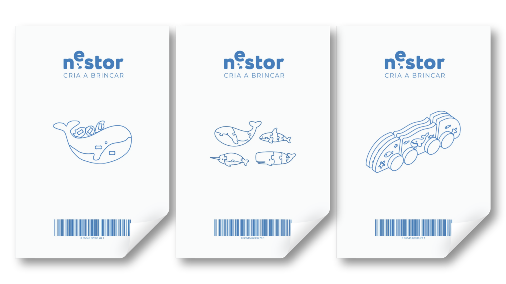
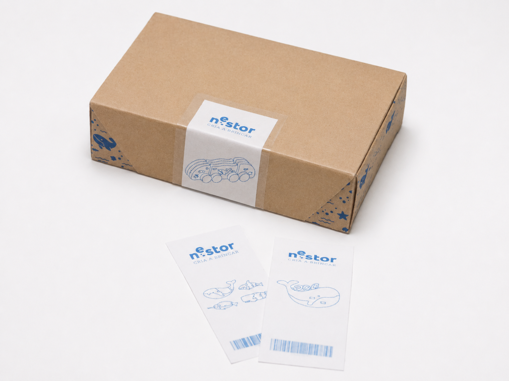
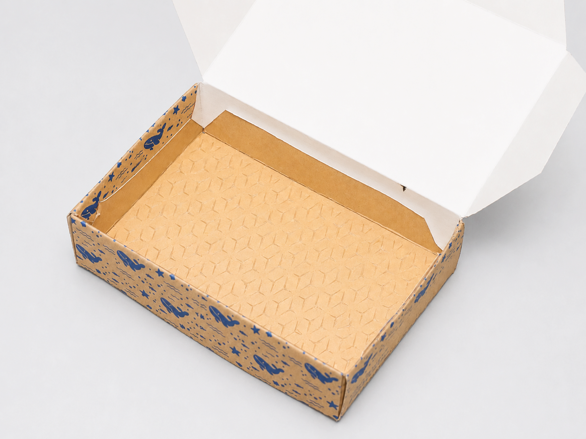
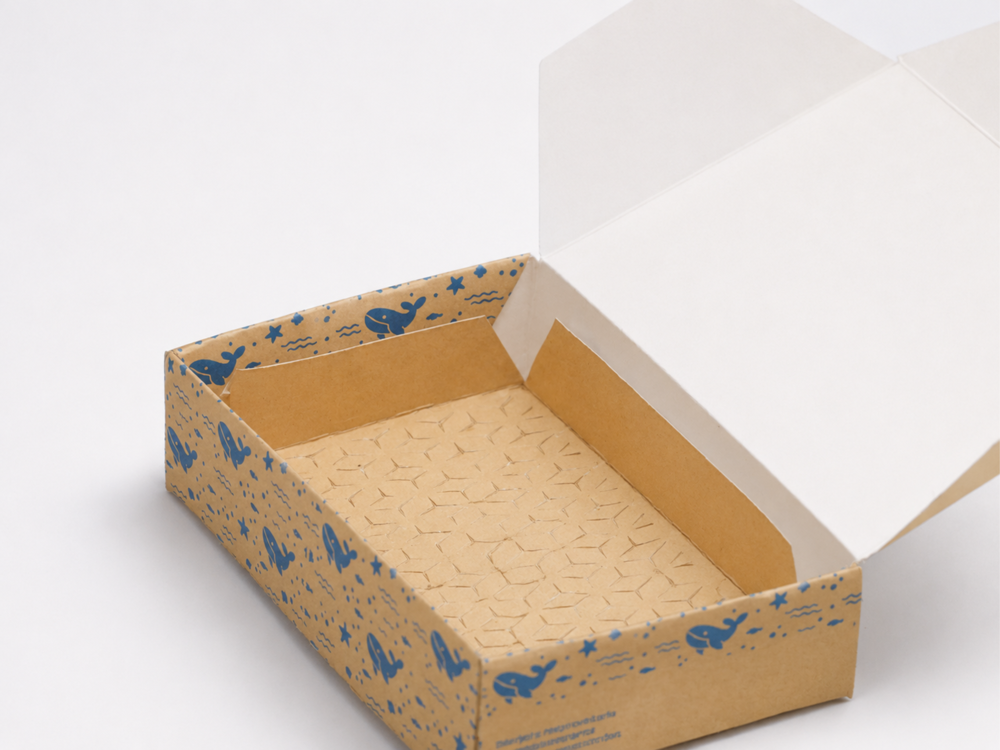
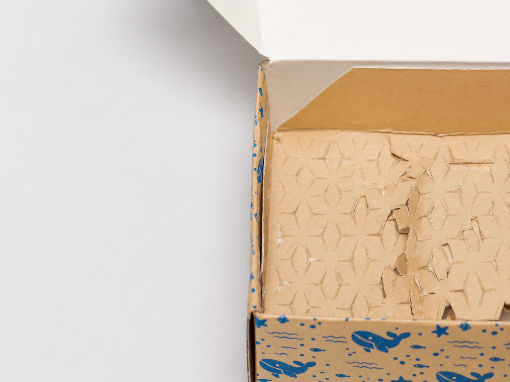

# Embalagem

> A embalagem da coleção Nestor foi desenvolvida para se adaptar às necessidades específicas de cada brinquedo, mantendo uma linguagem visual e construtiva comum. Esta abordagem garante flexibilidade dimensional sem comprometer a identidade gráfica e os valores da marca.
> 
> **[ENG]** The Nestor collection packaging was designed to adapt to the specific needs of each toy while maintaining a consistent visual and structural language. This approach ensures dimensional flexibility without compromising the brand's graphic identity and core values.
## Conceito

O conceito da embalagem assenta na criação de uma solução simples, sustentável e facilmente replicável para toda a coleção Nestor.
A utilização de cartão canelado, associada à aplicação de carimbos e etiquetas de identificação, permite reduzir materiais e processos desnecessários, mantendo uma produção acessível e coerente com os valores da marca.
Visualmente, a embalagem procura refletir a linguagem dos brinquedos através de uma estética minimalista inspirada no universo marinho.
A presença da identidade gráfica da Nestor reforça o reconhecimento da marca e estabelece uma ligação consistente entre os diferentes produtos da coleção. Desta forma, a embalagem não funciona apenas como proteção do objeto, mas também como um elemento de comunicação dos princípios de sustentabilidade, criatividade e aprendizagem que definem o projeto.

**[ENG]** 
The packaging concept is based on creating a simple, sustainable, and easily replicable solution for the entire Nestor collection.
The use of corrugated cardboard, combined with stamps and identification labels, helps reduce unnecessary materials and production processes while maintaining an accessible solution consistent with the brand’s values.
Visually, the packaging reflects the language of the toys through a minimalist aesthetic inspired by the marine environment.
The presence of Nestor’s visual identity strengthens brand recognition and establishes a consistent connection between the different products in the collection. In this way, the packaging functions not only as a means of protecting the product, but also as a communication tool that conveys the principles of sustainability, creativity, and learning that define the project.

## Processo

O desenvolvimento da embalagem iniciou-se com a pesquisa de soluções sustentáveis e sistemas de acondicionamento para brinquedos educativos, a partir desta análise, foram exploradas diferentes configurações de caixa capazes de acomodar os vários produtos da coleção Nestor, mantendo uma identidade visual comum.
A solução final recorre a cartão canelado, carimbos e etiquetas de identificação, permitindo adaptar a embalagem a diferentes dimensões sem comprometer a coerência gráfica da marca. Para reforçar a proteção dos produtos, prevê-se ainda a utilização de um inserto em cartão com **estrutura auxética** obtida através de cortes paramétricos, capaz de se expandir e adaptar à forma do objeto. Esta solução funciona como elemento de amortecimento e acondicionamento, reduzindo a necessidade de materiais adicionais e reforçando o caráter sustentável da embalagem.

**[ENG]** The packaging development began with research into sustainable solutions and packaging systems for educational toys. Based on this analysis, different box configurations were explored in order to accommodate the various products within the Nestor collection while maintaining a consistent visual identity.
The final packaging solution uses corrugated cardboard, stamps, and identification labels, allowing it to be adapted to different dimensions without compromising the brand’s visual consistency. To further enhance product protection, the packaging incorporates a cardboard insert based on an auxetic structure created through parametric cut patterns, enabling the material to expand and conform to the shape of the object. This solution acts as both a cushioning and securing element, reducing the need for additional materials while reinforcing the sustainable character of the packaging.

**Planificação da embalagem/Packaging Dieline:**

**Medidas:**

**Adesivos de identificação:**

**Representação e maquetização:**

A estrutura auxética funciona como uma malha de retenção que se adapta à forma do objeto através da sua capacidade de expansão. 
Ao envolver o produto, mantém-no fixo e protegido no interior da embalagem, absorvendo pequenos impactos e evitando deslocações durante o transporte. 
Esta solução permite substituir sistemas convencionais de enchimento, contribuindo para uma embalagem mais eficiente e sustentável.

**[ENG]** The auxetic structure acts as a retention mesh that adapts to the shape of the object through its ability to expand. By enveloping the product, it keeps it securely fixed and protected inside the packaging, absorbing minor impacts and preventing movement during transport. This solution replaces conventional filling materials, contributing to a more efficient and sustainable packaging system.
## Embalagem final

